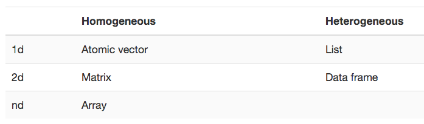

***
#Introduction
> There are two meta-techniques that are tremendously helpful for improving your skills as an R programmer: **reading source code** and adopting a **scientific mindset**.

###1. reading source code:
  * find patterns that are worth emulating
  * find patterns that that you don't like

###2. scientific mindset:
> If you don’t understand how something works, develop a hypothesis, design some experiments, run them, and record the results. And do it again untill you know enough or you know it's not enough.
  
***
#Foundations
##Data Structure


* no 0-d, scalar type, just vector of length 1
* best way to understand a data strcuture in R:
    * `str()`,it gives a compact, human readable description of any R data structure.

***    
###Vectors
`atomic vector` vs `list`

* common property:
    * `typeof()`
    * `length()`
    * `attributes()`
    
* test: `is_atomic()`, `is_list()`

####Atomic vector (same type)
usually created by using `c()`

`1:10` will create integer vector

* 4 common types of atomic vector: (2 rare type: complex, raw)    
    * logical
    * integer
    * double
    * character
```{r eval=FALSE}
c(1,2,3) # double
c(1L,2L,3L) # L suffix for ingeger
c(TRUE, FALSE) # logical
c("hello", "world") # character
```
* missing value: `NA`

#####Types and tests
* `is.atomic()`
    * `is.character()`
    * `is.double()`
    * `is.integer()`
    * `is.logical()`
 
```{r}
int_vec <- c(1L, 2L)
is.integer(int_vec)

dbl_vec <- c(1, 2)
is.double(dbl_vec)
is.atomic(dbl_vec)
```

#####Coercion
  * `as.character()`
  * `as.double()`
  * `as.integer()`
  * `as.logical()`

***
####List (combine any type)
recursive vector, created by using `list()`
```{r}
x <- list(1:3, 'a', c(TRUE, TRUE), c(2.3,5.9))
str(x)
is.recursive(x)
```
```{r}
x <- list(list(1, 2), c(3, 4)) # will form multilevel vector
str(x)
y <- c(list(1, 2), c(3, 4)) # will combine two list into one list
str(y)
```

#####type, test, coercion
* `is.list()`
* `as.list()`
* `unlist()`: make list into an atomic vector

***
###Attribures
used to store metadata about the project. list of (tag, value) pairs
```{r attribute}
y <- 1:10
attr(y, 'name') <- 'This is a vector' # assign attribute
attr(y, 'name') # read attribute

str(attributes(y)) # use attributes(object) to get all attributes
```

#####named vector
```{r named vector}
x <- c(a=1, b=2, c=3)
x <- 1:3; names(x) <- c('a', 'b', 'c')
x
```
```{r remove name}
unname(x) # create a new vector without name, orignal x is not affected
x

names(x) <- NULL # this is in place modification
x
```

***
###Factors
A factor is a vector that can **contain only predefined values**, and is used to store **categorical data**. Factors are useful when you know the possible values a variable may take, even if you don’t see all values in a given dataset.

You must know we could only be M or F as a human.
One benefits here is that we don't have f in the `sex_char`, but we may want to know that fact. If we use simple char vector, the `table()` can't show what doesn't exist. But the on `sex_factor`, it shows.
```{r}
sex_char <- c("m", "m", "m")
sex_factor <- factor(sex_char, levels =c('m', 'f'))

table(sex_char)
table(sex_factor)
```

***
###Matrices and arrays
* `matrix()`: 2-d array
* `array()`: n-d array
```{r matrix and array}
x <- matrix(1:12, ncol = 3, nrow = 4) # two arguments to specify rows and columns
x

y <- array(1:12, c(2, 3, 2)) # 1 vector argument to describe all dim
y
```

So in vector, we are talking about names and length, here we have high dimensional generalizations:

* `length()` -> `nrow()`, `ncol()`, `dim()`
* `names()` -> `rownames()`, `colnames()`, `dimnames()`
* `c()` -> `cbind()`, `rbind()`
* `t()` -> `aperm()`

####test and coercion
* `is.matrix()`, `is.array()`
* `as.matrix()`, `as.array()`

***
###Data Frames
creation: `data.frame()`, takes variable name and it's associate data. You could imaging that instilling data frame by columns.
```{r}
df <- data.frame( x=1:3, 
                  y=c('a','b','c'),
                 stringsAsFactors = FALSE) # this arg will not turn strings into factors
str(df)
```
```{r}
class(df)
is.data.frame(df)
```

You can coerce an object to a data frame with `as.data.frame()`:

* A vector will create a one-column data frame.
* A list will create one column for each element; it’s an error if they’re not all the same length.
* A matrix will create a data frame with the same number of columns and rows as the matrix.

#####Combining data frames
```{r}
cbind(df, data.frame(z = 3:1))
rbind(df, data.frame(x = 10, y ='z'))
```


