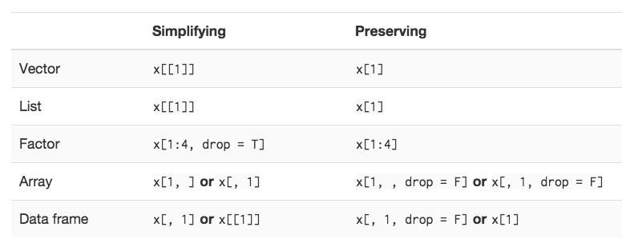

> `str()` shows you the structure of any object, and **subsetting** allows you to pull out the pieces that you’re interested in.

##Data types
### 1. Atomic vectors
```{r}
x <- c(2.1, 4.2, 3.3, 5.4) # number after the decimal point gives the original position in the vector
```
***

####things you can use to subset a vector:

1. **positive integer** (what you want)
```{r}
x[c(3,1)]
x[order(x)] # order return sorted index, this line == sort(x)
x[c(1,1)] # return duplicate values
```
2. **negative integer** (what you don't want)
```{r}
x[-1]
```
3. **logical vector**
```{r}
x[c(TRUE, TRUE, FALSE, FALSE)]
x[x>3]
```
if logical vector is shorter than input vector, it will recycle to be the same length
```{r}
x[c(TRUE, FALSE)]
```
4. **nothing**, `x[]`: return original vector
5. **zero**, `x[0]`: return zero-length vector
6. **character vectors**, return elements with matching names
```{r}
y <- setNames(x, letters[1:4])
y[c("d", "c", "a")]
```
***

### 2. Matrices and arrays
```{r}
a <- matrix(1:9, nrow=3)
colnames(a) <- c('A', 'B', 'C')

a[1:2, ] # keep all colums
```

### 3. Data frames
> list of columns

```{r}
df <- data.frame(x=1:3, y=3:1, z=letters[1:3])
df[df$x ==2,] # take 2nd row
df[c(1,3), ] # take 1, 3 row
df[c('x', 'z')] # == df[, c('x', 'z')]
```
if only choose one colume,
```{r}
str(df['x']) # this subsetting would not simplify automatically
str(df[, 'x']) # auto simplify
```

notes inspired from exercise:

* `upper.tri()`
* `diag()`

> Implement your own function that extracts the diagonal entries from a matrix (it should behave like diag(x) where x is a matrix).

```{r my_diag version1}
my_diag <- function(m){
  count <- min(ncol(m), nrow(m))
  if (count>1){
    res <- c()
    for (i in 1:count){
      res <- c(res, m[i,i])
    }
    res
  }
}
```
```{r}
a
my_diag(a)
```
#todo: I don't like this version, redo!

***
##Subsetting operators
1. `[[`, return single value
2. `$`, often used to access variables in a data frame, as in mtcars$cyl or diamonds$carat.

> If list x is a train carrying objects, then `x[[5]]` is the object in car 5; `x[4:6]` is a train of cars 4-6.

```{r}
a <- list(a=1, b=2)
a[[1]]
a[['a']]
```
In this named list case, you can see the difference:
```{r}
typeof(a[1]) # this is still a list, you could use a[1][[1]] to get a[[1]] value
typeof(a[[1]]) # this would be "that" value you want
```

about `$`
```{r}
mtcars$cyl
mtcars[['cyl']]
```

There’s one important difference between $ and [[. `$` does partial matching

###Simplifying vs preseving
> **Simplifying** subsets returns the simplest possible data structure that can represent the output, and is useful interactively because it usually gives you what you want. 

> **Preserving** subsetting keeps the structure of the output the same as the input, and is generally better for programming because the result will always be the same type.



###Modify subset
```{r}
x <- 1:5
x[1:3] <- 6:8
x
```

> Subsetting with nothing can be useful in conjunction with assignment because it will preserve the original object class and structure.

```{r}
mtcars[] <- lapply(mtcars, as.integer) # still a data frame
mtcars <- lapply(mtcars, as.integer) # list
```

**Todo: skipped application part. To much for now, pick up later**

***
####exercise:

1. > randomly permute the columns of a data frame?

```{r}
df
df2 <- df[sample(nrow(df)), sample(ncol(df))] # row and col same time
df2

df2 <- df[sample(nrow(df)), ] # suffle only rows, you know how to do only cols
df2
```

2. > put the columns in a data frame in alphabetical order?

```{r}
str(mtcars[order(names(mtcars))])
```


