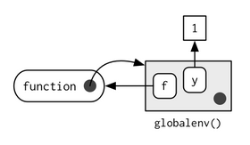

***

> Environment has reference semantics -> When you modify a binding in an environment, the environment is not copied; it’s modified in place.

#Basics
> The job of an environment is to associate as set of names to a set of values.

This is actully a function, a dictionary, an one level deep relationship.

> Every environment has a parent, another environment. The parent is used to implement lexical scoping: if a name is not found in an environment, then R will look in its parent (and so on). Only one environment doesn’t have a parent: the empty environment.

> an environment is similar to a list, with four important exceptions:
>
> 1. Every object in an environment has a unique name.
> 2. The objects in an environment are not ordered (i.e., it doesn’t make sense to ask what the first object in an environment is).
> 3. An environment has a parent.
> 4. Environments have reference semantics.

###4 special environments
1. `globalenv()`, env in which you normally work
2. `baseenv()`, env of base package, parent = empty
3. `emptyenv()`, ultimate ancestor of all env
4. `environment()`, current env

###search path


###create env
```{r}
e <- new.env()
e$name <- 'new env'
parent.env(e) # see parent env
ls(e) # list objects of this env
```

###create and modify bindings
```{r}
e$a <- 1
e$b <- 2
ls(e)
ls.str(e) # show str of every object in this env
```

###remove bindings
```{r}
e$a <- NULL # won't remove the binding, just map a to NULL
rm('a', envir = e) # this is what you want
```

###check in object's existance
```{r}
x <- 2 # in global
exists("x", envir = e, inherits = FALSE) # inherits = F won't look up to global
```

###compare env
```{r}
identical(globalenv(), environment())
```

####excercise
> Using parent.env() and a loop (or a recursive function), verify that the ancestors of globalenv() include baseenv() and emptyenv().

```{r}
find_source <- function(env) {
  if (identical(env, emptyenv()))
    return(F)
  else if (identical(env, baseenv()))
    return(identical(parent.env(env), emptyenv()))
  else 
    find_source(parent.env(env))
}

find_source(globalenv())
```

###
#Recursing over envs
```{r}
where <- function(name, env = parent.frame()) {
  if (identical(env, emptyenv()))
    stop("Can't find ", name, call. = F)
  else if (exists(name, envir = env, inherits = F))
    env
  else
    where(name, parent.env(env))
}

where('filter')
```

####exercise
> Write your own version of `get()`

```{r}
my_get <- function(obj_name, env = parent.frame()) {
  if (identical(env, emptyenv()))
    stop("The object doesn't exist", call. = F)
  else if (exists(obj_name, env))
    return(env[[obj_name]]) # why env$obj_name not work?
  else
    my_get(obj_name, parent.env(env))
}

x <- 1
my_get('x') == get('x')
```

#Function environments
> 1. enclosing, where the function is created
> 2. binding, `<-` binding fn to name
> 3. execution, ephemeral execution env that stores variables during execution
> 4. calling, where the fn is called

###enclosing + binding env

```{r}
y <- 1
f <- function(x) x+y

environment(f)
```



###execution env
> like what you imagine about the temp env create during a function execution.


###calling env
> if you are using some var in a fn execution, but didn't define it in the body, maybe it needs to resovle the value all the way to globalenv(), this is your calling env that will affect your result of fn call.

#Binding names to values
> you can not only bind **values** to names, but you can also bind **expressions* (promises) or even **functions**, so that every time you access the value associated with a name, you get something different!

> * regular assignment `<-`, creates a variable in the current environment
>
> * deep assignment `<<-`, modifies an existing variable found by walking up the parent environments. If `<<-` doesn’t find an existing variable, it will create one in the **global environment**.

```{r}
x <- 1
f <- function() x <<- 2
f()
x
```


