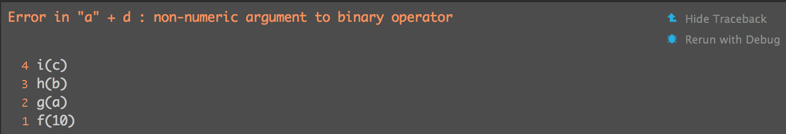

***

> Let the code communicate problems to you:
>
> * `stop()` termiante all execution for fatal errors
> * `warning()` for potential problems
> * `message()` give info output that can easily be suppresed, so you don't have to manually switch off debugging message.

> The basic principle of **defensive programming** is to **fail fast**, to raise an error as soon as something goes wrong. 
>
> 1. checking that inputs are correct, `stopifnot()`
> 2. avoiding non-standard evaluation
> 3. avoiding functions that can return different types of output

***
#Debugging techniques
> ###1. Realise that you have a bug
>
> ###2. Make it repeatable
>    * start with a big block of code that you know causes the error and then slowly whittle it down to get to the smallest possible snippet that still causes the error. **Binary search** is particularly useful for this. To do a binary search, you repeatedly remove half of the code until you find the bug.
>    * If your existing test coverage is low, take the opportunity to add some nearby tests to ensure that existing good behaviour is preserved.
>
> ###3. Figure out where it is
>    * Generate hypotheses, design experiments to test them, and record your results. 
>    * Systematic approach will end up saving you time. I often waste a lot of time relying on my intuition to solve a bug.
>
> ###4. Fix it and test it

***
#Debugging tools
###call stack
> the sequence of calls that lead up to an error

```{r eval=F}
f <- function(a) g(a)
g <- function(b) h(b)
h <- function(c) i(c)
i <- function(d) "a" + d
f(10)
```


> or in traditional R console, you can use `traceback()`

###browsing on error
... didn't get it really much

#todo: read [RStudio debugging doc](https://support.rstudio.com/hc/en-us/articles/205612627-Debugging-with-RStudio) for debugging tools

***

#Condition handling
> Unexpected errors require interactive debugging to figure out what went wrong. Some errors, however, are expected, and you want to handle them automatically.
> `try()`
> `tryCatch()`

###`try(expr, silent = FALSE)`
> allows execution to continue even after an error has occurred

```{r eval=F}
f1 <- function(x)
  log(x)

f1('x') # this will cause error and terminate program
```
```{r}
f2 <- function(x) {
  try({
    log(x)
  })
  
  10
}

f2('x') # here, we use try to pass error, the next expression is 10, that's the return
```

###`tryCatch(expr, ..., finally)`
```{r}
show_condition <- function(code) {
  tryCatch(code,
    error = function(c) "error",
    warning = function(c) "warning",
    message = function(c) "message"
  )
}
show_condition(stop("!"))
#> [1] "error"
show_condition(warning("?!"))
#> [1] "warning"
show_condition(message("?"))
#> [1] "message"

# If no condition is captured, tryCatch returns the 
# value of the input
show_condition(10)
#> [1] 10
```

***

#Defensive programming
> Defensive programming is the art of **making code fail in a well-defined manner** even when something unexpected occurs.

> There is a tension between interactive analysis and programming. When you’re working interactively, you want R to do what you mean. If it guesses wrong, you want to discover that right away so you can fix it. When you’re programming, you want functions that signal errors if anything is even slightly wrong or underspecified. Keep this tension in mind when writing functions. If you’re writing functions to facilitate interactive data analysis, feel free to guess what the analyst wants and recover from minor misspecifications automatically. If you’re writing functions for programming, be strict. Never try to guess what the caller wants.


